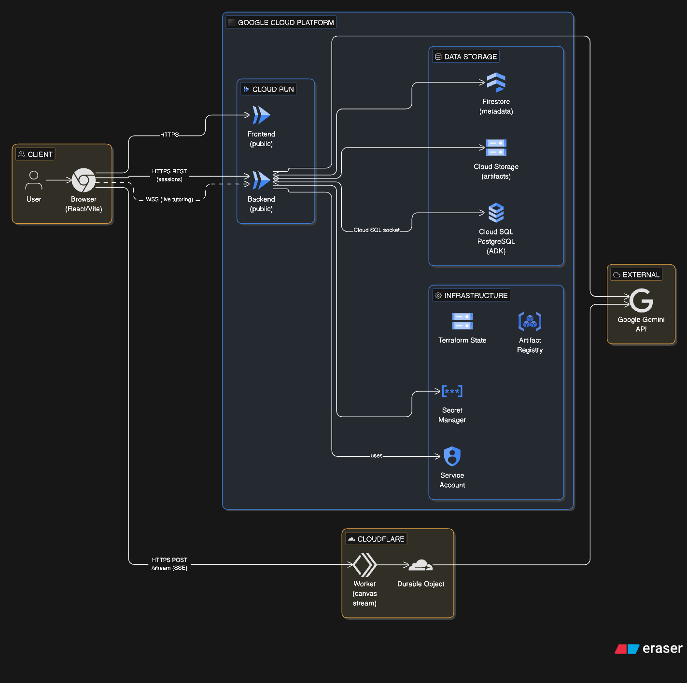
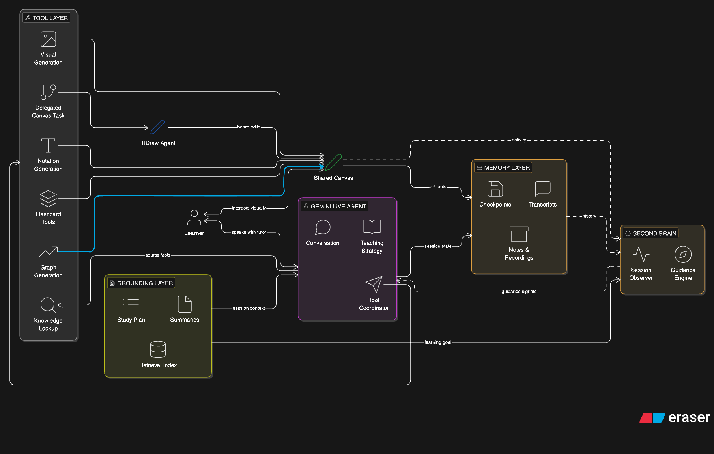
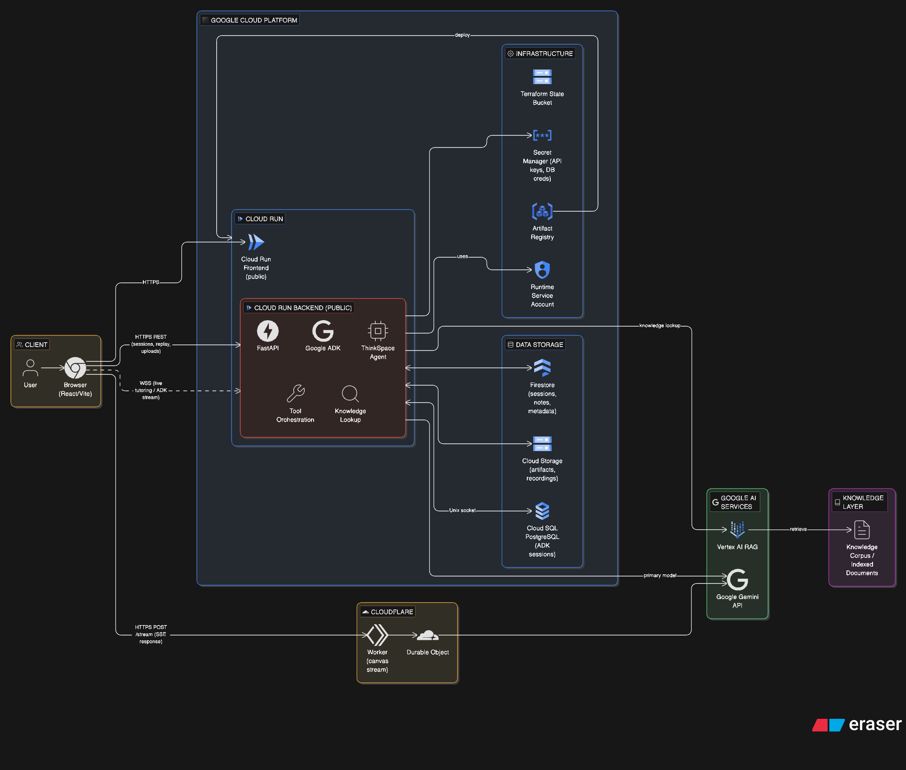

# ThinkSpace

ThinkSpace is a full-stack project with:

- a React + Vite frontend in `frontend/`
- a FastAPI backend in `backend/`
- optional infrastructure and deployment automation in `infra/` and `.github/workflows/`

This README is focused on helping you run the project locally first, then optionally enable CI/CD later.

## Start Here

For the most complete system overview, read `docs/thinkspace-end-to-end-technical-architecture.md`.

If you want to understand how the full ThinkSpace platform fits together end to end, this is the primary architecture document and should be read before the infrastructure and deployment details below.

## Project Structure

```text
ThinkSpace/
|- frontend/   # React + Vite app
|- backend/    # FastAPI app
|- infra/      # Terraform for GCP infrastructure
`- .github/    # GitHub Actions workflows
```

## Architecture Diagrams

### Overall ThinkSpace Architecture



### Agent Architecture



### Cloud Deployment Architecture



## tldraw And Licensing

ThinkSpace uses `tldraw` as a third-party dependency for the canvas experience.

Important notes:

- `tldraw` is not custom code owned by this repository; it is third-party code integrated into the frontend.
- for the GCP deployed application, we are using a `tldraw` trial license with a validity of 100 days
- for local development, no separate `tldraw` license is needed

## Deployment Note For Cloudflare

Cloudflare deployment is required only for the production application when you want the hosted `/stream` endpoint for the canvas agent.

For local testing:

- Cloudflare deployment is not required
- you can run the frontend and backend locally without deploying the Cloudflare worker
- local testing of the main frontend and backend flows does not depend on production Cloudflare infrastructure

## Prerequisites

Install these before you begin:

- Node.js 20 or newer
- npm
- Python 3.10 or newer
- `uv` for Python dependency management

Install `uv` if needed:

```bash
curl -LsSf https://astral.sh/uv/install.sh | sh
```

## Local Setup

### 1. Clone the repository

```bash
git clone https://github.com/trishulam/ThinkSpace
cd ThinkSpace
```

### 2. Start the backend

The backend runs on `http://localhost:8000` by default.

1. Create `backend/app/.env` with at least:

```bash
GOOGLE_GENAI_USE_VERTEXAI=FALSE
GOOGLE_API_KEY=your_google_api_key_here
DEMO_AGENT_MODEL=gemini-2.5-flash-native-audio-preview-12-2025
```

2. Install backend dependencies and run the server:

```bash
cd backend
./start_backend.sh
```

That script will:

- install locked dependencies with `uv`
- start FastAPI with auto-reload
- serve the backend on port `8000`

If you prefer the manual command:

```bash
cd backend
uv sync --locked
PYTHONPATH=app uv run uvicorn app.main:app --reload --host 0.0.0.0 --port 8000
```

### 3. Start the frontend

Open a second terminal:

```bash
cd frontend
npm ci
```

Create `frontend/.env.local`:

```bash
VITE_AGENT_BACKEND_URL=ws://localhost:8000
VITE_SESSION_API_BASE_URL=http://localhost:8000
# Optional: enable session recording inside the canvas flow
VITE_ENABLE_SESSION_RECORDING=false
```

If you want to use the canvas agent, also create `frontend/.dev.vars`:

```bash
GOOGLE_API_KEY=your_google_api_key_here
```

Optional:

```bash
VITE_TLDRAW_AGENT_STREAM_URL=https://your-worker-url/stream
```

Set `VITE_ENABLE_SESSION_RECORDING=true` only if you want the canvas session flow to capture a recording. By default this flag is `false`.

Then run the frontend:

```bash
npm run dev
```

The frontend will be available at `http://localhost:5173`.

## Local Development Notes

### Which environment variables matter?

For the frontend:

- `VITE_AGENT_BACKEND_URL`: WebSocket URL for live backend sessions
- `VITE_SESSION_API_BASE_URL`: REST API base URL for dashboard and session APIs
- `VITE_TLDRAW_AGENT_STREAM_URL`: canvas agent stream endpoint
- `VITE_ENABLE_SESSION_RECORDING`: enables recording during the session canvas flow; default is `false`
- `frontend/.dev.vars`: required for the canvas agent worker locally; at minimum set `GOOGLE_API_KEY`

If `VITE_ENABLE_SESSION_RECORDING=true`, the canvas session waits for recording to start and captures the session recording flow. If it is `false`, the live session can continue without recording.

For the backend:

- `GOOGLE_API_KEY`: required for Gemini features
- `GOOGLE_GENAI_USE_VERTEXAI`: set to `FALSE` for API key usage, `TRUE` for Vertex AI
- `DEMO_AGENT_MODEL`: optional model override

### Do I need the Cloudflare worker for local setup?

Not for basic frontend + backend local development.

Cloudflare deployment is only required for the production application.

For local testing, you do not need to deploy the Cloudflare worker. If you want to use the canvas agent locally, make sure `frontend/.dev.vars` exists. If you also want canvas session recording, set `VITE_ENABLE_SESSION_RECORDING=true` in `frontend/.env.local`. You only need `VITE_TLDRAW_AGENT_STREAM_URL` when you specifically want the `/canvas` flow to use a deployed `/stream` endpoint.

### Default local URLs

- Frontend: `http://localhost:5173`
- Backend HTTP: `http://localhost:8000`
- Backend WebSocket base: `ws://localhost:8000`

## Quick Verification

Once both services are running:

1. Open `http://localhost:5173`
2. Confirm the frontend loads
3. Confirm backend-backed pages can create or fetch session data
4. If using live sessions, verify the frontend can connect to `ws://localhost:8000`

## Useful Commands

Frontend:

```bash
cd frontend
npm run dev
npm run build
npm run typecheck
```

Backend:

```bash
cd backend
uv sync --locked
./start_backend.sh
```

## CI/CD Options

CI/CD is optional. You can keep this project as local-only, or enable GitHub Actions for automated checks and deployments.

### Option 1: CI/CD disabled

Choose this if you only want local development.

No extra setup is required for local work.

If this repository is hosted on GitHub and you want to stop workflows from running:

- disable GitHub Actions for the repository in GitHub settings, or
- disable individual workflows from the GitHub Actions tab

In this mode, you can still build and run everything locally using the steps above.

### Option 2: CI/CD enabled

This repository already includes these workflows:

- `.github/workflows/ci.yml`
- `.github/workflows/deploy-gcp.yml`
- `.github/workflows/deploy-cloudflare-worker.yml`

#### What each workflow does

`ci.yml`

- installs frontend dependencies
- typechecks and builds the frontend
- syncs backend dependencies
- compiles backend Python sources
- validates Terraform formatting and configuration

`deploy-gcp.yml`

- builds backend and frontend container images with Cloud Build
- deploys backend and frontend to Cloud Run
- runs smoke checks after deployment

`deploy-cloudflare-worker.yml`

- syncs the worker secret from Google Secret Manager
- deploys the Cloudflare Worker used for the production `/stream` endpoint

## How To Enable CI/CD

### 1. Push the repository to GitHub

Make sure the code is in a GitHub repository where Actions are enabled.

### 2. Prepare cloud infrastructure

Before enabling deployment workflows, make sure the infrastructure is ready.

Use the Terraform setup in `infra/README.md` to provision:

- Artifact Registry
- Cloud Run
- Firestore
- Cloud Storage
- Secret Manager
- Cloud SQL

### 3. Configure GitHub Actions variables

Add these repository variables in GitHub:

- `GCP_WORKLOAD_IDENTITY_PROVIDER`
- `GCP_SERVICE_ACCOUNT_EMAIL`
- `CLOUDFLARE_ACCOUNT_ID`

### 4. Configure GitHub Actions secrets

Add this repository secret in GitHub:

- `CLOUDFLARE_API_TOKEN`

### 5. Configure Google Cloud access for GitHub OIDC

The Google service account referenced by `GCP_SERVICE_ACCOUNT_EMAIL` must be allowed to:

- run Cloud Build
- deploy to Cloud Run
- access Secret Manager
- use Artifact Registry
- run Terraform against the target project

You also need a Workload Identity Provider that trusts your GitHub repository.

### 6. Add required runtime secrets in GCP

At minimum, make sure the Google API key secret exists in Secret Manager.

Example:

```bash
printf '%s' 'YOUR_GOOGLE_API_KEY' | gcloud secrets versions add thinkspace-google-api-key --data-file=-
```

### 7. Enable workflows

Recommended rollout:

1. Enable `ci.yml` first
2. Confirm pull requests and pushes pass basic checks
3. Enable `deploy-gcp.yml` after infrastructure is ready
4. Enable `deploy-cloudflare-worker.yml` when the worker deployment is needed

## Recommended CI/CD Flow

For most teams, this is the simplest approach:

1. Use local setup for development
2. Enable `ci.yml` first for validation on pull requests
3. Keep deploy workflows disabled until cloud credentials and infra are ready
4. Enable deployment workflows only after a successful manual infrastructure setup

## Troubleshooting

### Frontend cannot talk to the backend

Check:

- backend is running on port `8000`
- `frontend/.env.local` points to `ws://localhost:8000` and `http://localhost:8000`
- you restarted the frontend dev server after changing environment variables

### Backend fails to start

Check:

- Python version is `3.10+`
- `uv` is installed
- `backend/app/.env` exists
- `GOOGLE_API_KEY` is set if Gemini features are used

### CI/CD fails after enabling workflows

Check:

- GitHub Actions variables and secrets are configured
- GCP Workload Identity is set up correctly
- required GCP resources already exist
- Cloudflare account and token are valid

## Additional Docs

- `frontend/README.md` for frontend-specific details
- `backend/README.md` for backend-specific details
- `infra/README.md` for GCP and Terraform setup
