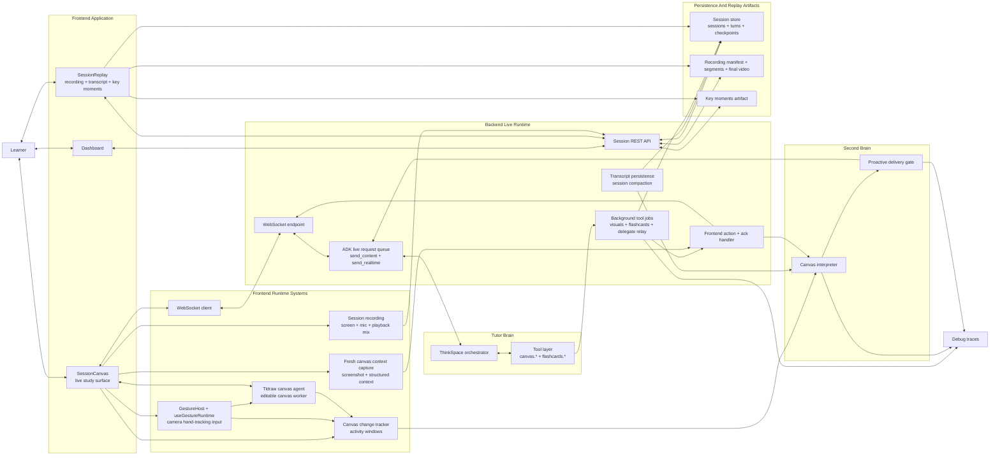
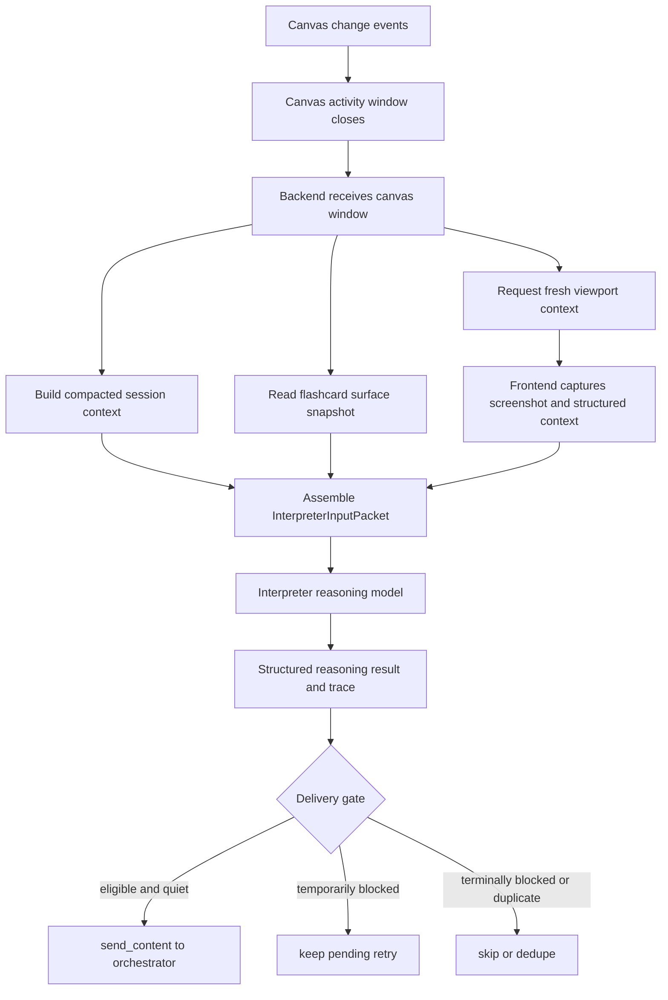
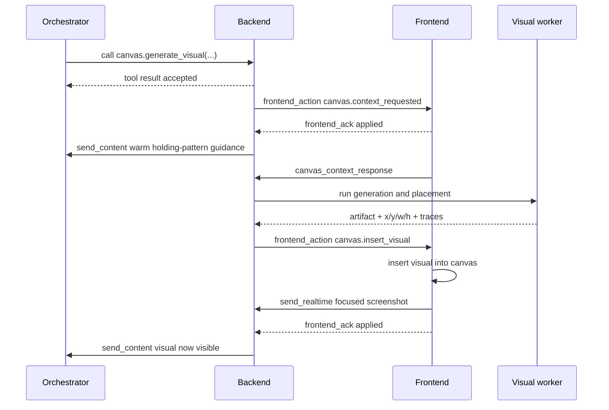
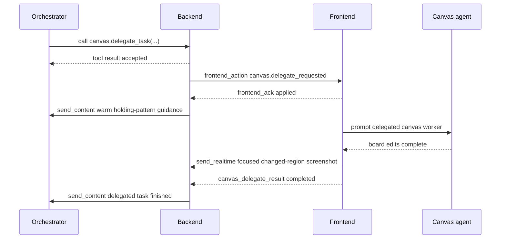
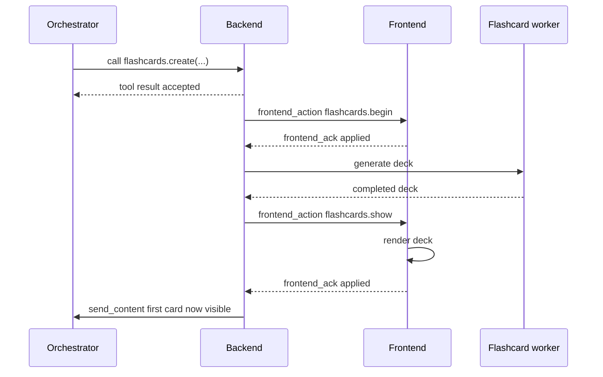
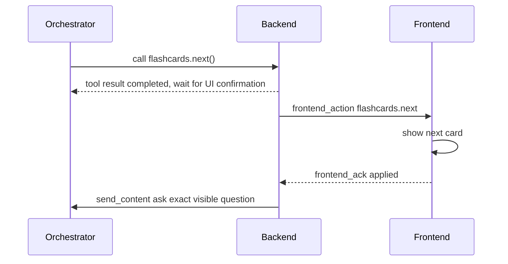
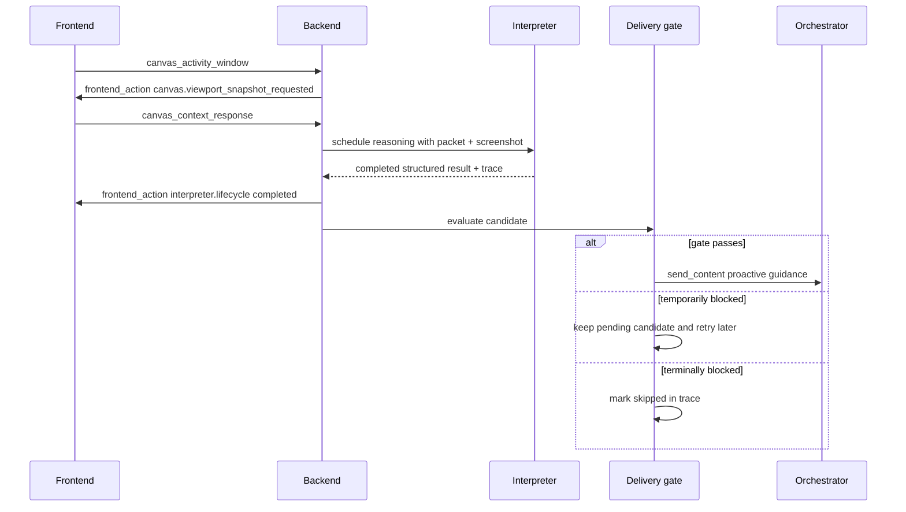

# ThinkSpace Architecture Reference

## Purpose

This document is the implementation-oriented reference for how ThinkSpace works
today across:

- the tutor orchestrator
- the backend live session runtime
- frontend canvas and flashcard execution
- two-way frontend actions and acknowledgements
- tool execution and background jobs
- multimodal perception via `send_content(...)` and `send_realtime(...)`
- the canvas interpreter "second brain"
- trace and observability flows

It is intended to be precise enough for engineers extending the system while
still readable enough for hackathon teammates who need a reliable mental model
of the product.

## Current Implemented Surface

The currently registered and implemented orchestrator-facing tools are:

- `canvas.generate_visual`
- `canvas.delegate_task`
- `canvas.viewport_snapshot`
- `flashcards.create`
- `flashcards.next`
- `flashcards.reveal_answer`
- `flashcards.end`

Important status notes:

- `canvas.generate_widget` is a valid future direction, but it is not currently
  wired into the runtime tool registry.
- `canvas.enhance` is documented historically but is not currently implemented
  in the live runtime.
- the system architecture already supports the main patterns a future
  `canvas.generate_widget` would need: async job execution, direct output
  insertion, placement context capture, and frontend acknowledgement.
- beyond the tool surface, the product also includes a gesture-control runtime,
  durable session persistence, recording upload/finalization, dashboard session
  browsing, and session replay.

## System Model

ThinkSpace is built around one top-level tutor brain and several specialized
execution/perception loops.

- The orchestrator is the only agent that owns tutoring strategy and the live
  conversation.
- The backend is the source of truth for tutoring semantics, session state, tool
  coordination, and proactive gating.
- The frontend is the execution surface for canvas changes, flashcard rendering,
  screenshots, and activity sensing.
- The canvas interpreter acts like a second reasoning layer over recent board
  activity. It does not replace the tutor; it produces optional pedagogical
  guidance for the tutor.

Diagram reading guide:

- the main tutoring loop is `Learner <-> Frontend Runtime <-> Backend Live Runtime <-> Tutor Brain`
- the frontend app has three important product surfaces: `Dashboard`,
  `SessionCanvas`, and `SessionReplay`
- the tool layer is chosen by the orchestrator but executed and coordinated by
  the backend runtime
- `SessionCanvas` is the live execution surface; it also captures fresh canvas
  context, emits canvas activity windows, hosts gesture control, and records the
  session
- the tldraw canvas agent is a frontend worker for editable canvas operations
- the gesture runtime is a frontend-only control/input layer that manipulates
  the editor locally and indirectly influences the rest of the system through
  canvas changes
- the canvas interpreter is the second-brain reasoning layer that consumes
  activity windows, fresh context, and compacted session state
- the proactive delivery gate decides whether interpreter output is sent back
  into the live tutor loop
- the session API and persistence layer back resume, recording manifests,
  finalized replay videos, checkpoints, transcript turns, and generated key
  moments
- traces are observability outputs, not part of the learner-facing runtime path

## Runtime Responsibilities

### 1. Orchestrator

The orchestrator is the single tutor identity. It:

- decides the next teaching move
- chooses when to call tools
- receives semantic tool updates and proactive interpreter guidance
- treats specialist workers as helpers, not separate user-facing agents

This is explicitly encoded in `backend/app/thinkspace_agent/instructions/base.md`.

### 2. Backend Live Runtime

The websocket endpoint in `backend/app/main.py` is the coordination hub. It:

- maintains the live ADK session
- streams user input and model output
- persists transcript turns
- relays frontend actions to the client
- receives frontend acknowledgements and semantic state returns
- relays background tool results
- triggers and gates interpreter delivery

### 3. Frontend Runtime

The frontend session page in `frontend/client/pages/SessionCanvas.tsx` is the
execution surface. It:

- renders canvas and flashcard state
- applies backend frontend actions
- sends structured acknowledgements back to the backend
- captures canvas screenshots and structured context on demand
- tracks canvas change events and activity windows
- runs delegated board edits through the tldraw canvas agent
- hosts the gesture-control runtime
- starts and uploads screen/audio recording segments for replay

### 4. Specialist Workers

There are two main specialist execution patterns today:

- backend-managed async workers for `canvas.generate_visual` and
  `flashcards.create`
- frontend-managed canvas execution for `canvas.delegate_task`

### 5. Gesture System

The gesture system is implemented entirely on the frontend. It:

- uses `GestureHost` and `useGestureRuntime(...)`
- acquires camera access
- runs hand landmarking and gesture classification locally
- maps stable gestures into cursor, draw, pan, and zoom interactions
- drives the tldraw editor without involving the backend directly

Important boundary:

- gesture input is part of the live user interaction system
- gesture semantics are not yet a backend interpreter input family
- the backend sees gesture effects indirectly through resulting canvas changes,
  checkpoints, and transcript context rather than through a dedicated gesture
  event protocol

### 6. Session Persistence And Replay

ThinkSpace also includes a non-live platform layer for session durability and
replay. It currently supports:

- backend-backed session metadata and resume
- transcript turn persistence
- frontend-driven checkpoint saving
- recording segment upload and finalization
- dashboard session browsing
- session replay with transcript, video, flashcard summaries, and generated key
  moments

Main frontend surfaces:

- `Dashboard.tsx`
- `SessionCanvas.tsx`
- `SessionReplay.tsx`

Main backend/persistence surfaces:

- session API routes in `frontend/client/api/sessions.ts`
- stored session resume payloads
- recording manifests and final replay video
- generated key moments artifacts

### 7. Second Brain

The interpreter pipeline observes recent canvas activity and produces optional
pedagogical steering. It is deliberately downstream of raw interaction and is
guarded before being reintroduced to the orchestrator.

## Perception Model

ThinkSpace does not rely on a single state channel. The orchestrator perceives
the session through several complementary signals.

### Conversation Perception

The live model sees direct conversation input and output through the normal ADK
stream. The backend also persists finalized turns and builds rolling compaction
state from them.

Sources:

- user text or audio input
- model output text or audio transcription
- persisted transcript turns in session storage
- compacted session summary from `session_compaction.py`

### Semantic Perception via `send_content(...)`

`send_content(...)` is used when the system wants to tell the orchestrator
something semantically meaningful.

Main uses:

- frontend-acknowledged UI completion updates
- background tool failure updates
- delegated canvas completion updates
- proactive interpreter guidance

Examples:

- "The next flashcard is now visible in the UI..."
- "The visual is now inserted on the canvas..."
- "The `canvas.generate_visual` job failed..."
- "Interpreter proactive update from the latest canvas understanding..."

Design rule:

- semantic updates are stronger than raw low-level event noise
- the system prefers to inject meaning only after the frontend confirms the
  visible state changed

### Perceptual Grounding via `send_realtime(...)`

`send_realtime(...)` is used for perceptual payloads, especially images.

Current uses:

- viewport screenshots returned by `canvas.viewport_snapshot`
- focused screenshots after successful visual insertion
- focused screenshots after delegated canvas changes
- direct user-provided images sent through the websocket

Design rule:

- screenshots are grounding signals, not automatic triggers to speak
- `send_realtime(...)` is selective, not continuous streaming of board changes

### Structured Canvas Context

Fresh canvas context is built in
`frontend/client/canvasPlacementPlannerContext.ts`. It includes:

- `captured_at`
- `user_viewport_bounds`
- `agent_viewport_bounds`
- `screenshot_data_url`
- `selected_shape_ids`
- `selected_shape_details`
- `blurry_shapes`
- `peripheral_clusters`
- `canvas_lints`

This same hybrid context pattern is reused for:

- placement reasoning
- viewport snapshot tool returns
- interpreter packet grounding

### Canvas Change Tracking

The frontend tracks shape create, update, and delete events using tldraw side
effects in `frontend/client/canvasChangeTracker.ts`.

Each event carries:

- `event_type`
- `occurred_at`
- `actor`
- `source`
- `shape_id`
- `shape_type`
- primitive summaries of the shape
- current shape metadata

Actor attribution is based on:

- explicit `shape.meta.thinkspace_actor === "agent"`
- whether the frontend tldraw agent is acting on the editor
- fallback source classification as `user` or `system`

### Provenance Metadata

Tutor-created artifacts are stamped with metadata so later perception can tell
who created what.

Current metadata patterns:

- generated visuals receive `thinkspace_actor`, `thinkspace_source_tool`,
  `thinkspace_artifact_id`, and `thinkspace_created_at`
- delegate-created shapes receive `thinkspace_actor`,
  `thinkspace_source_tool`, `thinkspace_delegate_job_id`, and
  `thinkspace_created_at`

This is important because the interpreter needs to distinguish learner actions
from tutor-initiated board changes.

### Compacted Session Context

The interpreter and future reasoning layers do not replay the entire transcript
every time. Instead, `session_compaction.py` maintains:

- a rolling semantic summary
- recent raw turns kept after compaction
- compaction freshness metadata

This gives the system:

- continuity without raw transcript bloat
- a summary of what has already been taught
- a lightweight context packet for the second brain

## Communication Surfaces

ThinkSpace uses a bidirectional websocket between frontend and backend, plus the
backend's live request queue into ADK.

### Main Message Types

| Direction | Message type | Purpose |
| --- | --- | --- |
| Frontend -> Backend | user text / audio / image messages | learner input and media |
| Backend -> Frontend | `frontend_action` | apply a UI-side action |
| Frontend -> Backend | `frontend_ack` | confirm an action applied or failed |
| Frontend -> Backend | `canvas_context_response` | return fresh structured canvas context |
| Frontend -> Backend | `canvas_delegate_result` | return delegated canvas completion/failure |
| Frontend -> Backend | `canvas_activity_window` | report a closed window of meaningful board edits |
| Backend -> Frontend | `tool_result` | expose tool status/results to the frontend log |
| Backend -> ADK | `send_content(...)` | semantic context injection |
| Backend -> ADK | `send_realtime(...)` | perceptual grounding, especially images |

### Frontend Action Contract

`frontend/client/types/agent-live.ts` defines the current action types:

- `canvas.job_started`
- `canvas.context_requested`
- `canvas.viewport_snapshot_requested`
- `canvas.delegate_requested`
- `canvas.insert_visual`
- `canvas.insert_widget`
- `interpreter.lifecycle`
- `flashcards.begin`
- `flashcards.show`
- `flashcards.next`
- `flashcards.reveal_answer`
- `flashcards.clear`

Not every action type is actively used in the current runtime. For example,
`canvas.insert_widget` is defined in the shared type surface but not yet wired by
an implemented tool.

### Frontend Ack Contract

The frontend responds with:

- `status: "applied" | "failed"`
- `action_type`
- `source_tool`
- optional `job_id`
- optional `summary`

This acknowledgement is extremely important. In ThinkSpace, backend tool
completion does not automatically imply visible UI completion.

## Core Interaction Pattern

The common end-to-end pattern looks like this:

1. The orchestrator calls a tool.
2. The backend returns a tool result, sometimes immediately and sometimes later.
3. If a frontend action is needed, the backend sends `frontend_action`.
4. The frontend applies the action.
5. The frontend sends `frontend_ack`.
6. The backend may convert that acknowledgement into a semantic
   `send_content(...)` update.
7. The orchestrator reasons from the confirmed visible state, not from a guess.

This pattern is why flashcards and canvas insertions do not get narrated before
the UI catches up.

## Tool Architecture

### Sequence: `canvas.generate_visual`

Purpose:

- create a rendered teaching artifact and place it on the canvas

Input contract:

- `prompt`
- `aspect_ratio_hint` in exactly `1:1`, `4:3`, `3:4`, `16:9`, or `9:16`
- `generation_mode` in `quality` or `fast`
- optional `placement_hint`
- optional `title_hint`
- optional `visual_style_hint`

Current execution shape:

1. validate inputs in `canvas_visuals.py`
2. create a per-job canvas-context request future
3. return `accepted`
4. send `canvas.context_requested` to the frontend
5. frontend captures fresh placement context
6. backend background job waits for that context
7. backend runs image generation and placement planning
8. backend publishes completed result with `canvas.insert_visual`
9. frontend inserts the asset into the canvas
10. frontend sends a focused screenshot via `send_realtime(...)`
11. frontend sends `frontend_ack`
12. backend converts the ack into semantic tutor context

Important behavior notes:

- the placement context is fresh per job, not connection-time cached context
- the tool is long-running
- the frontend-visible in-progress cue is currently driven by
  `canvas.context_requested`
- successful insertion, not backend job completion alone, is the point where the
  tutor may safely talk as if the visual is present

Observability:

- writes a dedicated `generate_visual` trace file
- records context wait timing
- records placement planner trace
- records image generator trace
- records total job duration

### Sequence: `canvas.delegate_task`

Purpose:

- hand off editable board-native work to the frontend tldraw canvas agent

Input contract:

- `goal`
- `target_scope` in `viewport` or `selection`
- optional `constraints`
- optional `teaching_intent`

Current execution shape:

1. backend validates the request and stores a delegate job record
2. backend returns `accepted`
3. backend sends `canvas.delegate_requested`
4. frontend shows an in-progress cue and immediately acks that the task started
5. frontend builds strong uppercase worker messages
6. frontend calls the tldraw canvas agent
7. frontend captures affected shapes for focused screenshot grounding
8. frontend sends `canvas_delegate_result`
9. backend publishes background result
10. backend sends semantic completion or failure context to the orchestrator

Important behavior notes:

- the backend reuses the original delegated goal instead of requiring a separate
  summarizer pass
- the canvas activity window manager is externally held open while the canvas
  worker is still alive, so one long delegate action is not split prematurely
- delegated completion is reported explicitly from the frontend rather than
  inferred indirectly

### `canvas.viewport_snapshot`

Purpose:

- let the orchestrator request a fresh current viewport understanding

Current execution shape:

1. backend verifies there is a live frontend bridge
2. backend creates a context request future
3. backend sends `canvas.viewport_snapshot_requested`
4. frontend builds a fresh context packet
5. frontend returns `canvas_context_response`
6. backend returns structured context payload to the tool caller
7. backend separately forwards the screenshot through `send_realtime(...)`

Design rule:

- the tool result contains structured semantic context
- the raw screenshot blob stays out of the tool result payload
- the screenshot is still delivered to the live model as perception

### Sequence: `flashcards.create`

Purpose:

- asynchronously create a study deck and show it in the frontend

Current execution shape:

1. backend accepts the request and allocates a job
2. backend sends `flashcards.begin`
3. backend background worker generates the deck
4. backend publishes completed result with `flashcards.show`
5. frontend renders the deck
6. frontend acks visibility
7. backend converts that ack into semantic tutor context

Important behavior notes:

- the frontend auto-shows the created deck
- the tutor should not assume the deck is visible until the ack-derived semantic
  update arrives

### Sequence: `flashcards.next`

Purpose:

- advance to the next card in an active deck

Current execution shape:

1. backend updates flashcard session state
2. backend returns a completed tool result with `flashcards.next`
3. frontend updates visible card state
4. frontend acks
5. backend converts the ack into a strict semantic prompt telling the tutor to
   ask the exact visible question

Important behavior notes:

- the tutor must not preview the next question in the same turn as the tool call
- the tutor must ask only the exact visible question after UI confirmation

### `flashcards.reveal_answer`

Purpose:

- reveal the answer for the current active card

Current execution shape:

1. backend updates flashcard session state
2. backend returns a completed tool result with `flashcards.reveal_answer`
3. frontend reveals the answer
4. frontend acks
5. backend converts the ack into semantic tutor context instructing the tutor to
   explain the now-visible answer and then pause

### `flashcards.end`

Purpose:

- clear the active flashcard UI and close the flashcard loop cleanly

Current execution shape:

- backend returns a completed tool result carrying the `flashcards.clear`
  frontend action
- frontend clears the flashcard panel
- frontend acknowledges the clear action

## Planned But Not Yet Implemented Tool Family

### `canvas.generate_widget`

This remains a strong future direction for charts, graphs, and interactive
teaching surfaces.

Most of the architecture it would need already exists:

- direct generated-output insertion rather than full board delegation
- fresh viewport context capture
- placement planning
- async background execution
- frontend action plus acknowledgement
- focused screenshot grounding

Most likely shape:

1. orchestrator provides chart/widget brief
2. backend obtains fresh placement context
3. widget generator produces HTML or similar artifact
4. planner decides `x/y/w/h`
5. frontend inserts widget
6. frontend acks
7. backend sends semantic confirmation

It should remain distinct from `canvas.generate_visual` because the output is a
live structured surface, not a static rendered artifact.

## Second Brain: Environment Interpreter

The environment interpreter is the second reasoning layer over the board. It is
not a visible tutor persona. Its job is to observe meaningful canvas change and
produce pedagogical guidance that the main tutor may or may not use.

### Trigger Source

The interpreter is triggered by frontend canvas activity windows, not by every
raw mutation.

Windowing behavior from `canvasActivityWindow.ts`:

- start collecting on first event
- close after 2 seconds of inactivity by default
- force-close after 15 seconds max duration by default
- merge ready windows when dispatch is still in progress
- defer timer-based closure if an external hold is active

This design prevents constant reasoning churn during active editing.

### Interpreter Pipeline

The pipeline is:

1. frontend closes a `CanvasActivityWindow`
2. frontend sends `canvas_activity_window`
3. backend builds compacted session context
4. backend snapshots current flashcard surface state
5. backend stores a pending interpreter snapshot job
6. backend asks the frontend for a fresh viewport snapshot
7. frontend returns fresh canvas context
8. backend assembles an `InterpreterInputPacket`
9. backend schedules reasoning
10. interpreter writes lifecycle and trace output
11. backend decides whether to deliver proactive semantic guidance

### Interpreter Input Packet

`backend/app/thinkspace_agent/context/interpreter_packet.py` assembles a packet
containing:

- session metadata
- trigger metadata
- the full canvas activity window
- fresh canvas context
- compacted session context
- surface-state summaries
- runtime context text
- optional previous interpreter summary slot

The packet deliberately mixes:

- structural edit history
- a fresh current viewport understanding
- compacted semantic lesson memory

### Interpreter Reasoning Output

The interpreter returns structured JSON with:

- `canvas_change_summary`
- `learner_state`
- `pedagogical_interpretation`
- `proactivity`
- `steering`
- `confidence`
- `safety_flags`

It can finish as:

- `completed`
- `stale`
- `failed`

### Mandatory Screenshot Grounding

The reasoning prompt explicitly requires both:

- the structured packet
- the accompanying screenshot

This is important because the second brain is meant to reason over what the
board now looks like, not only over symbolic deltas.

### Latest-Packet-Wins

The interpreter store is designed so newer windows supersede older ones.

Implications:

- stale results should not drive proactivity
- only the most relevant recent board state should influence delivery
- the system avoids queueing a long backlog of outdated interpreter outputs

## Interpreter Delivery Gate

Interpreter results do not automatically become tutor turns. The delivery gate
in `backend/app/main.py` is intentionally strict.

### A result is eligible only if

- status is `completed`
- it is the latest relevant result when checked
- `proactivity.is_candidate == true`
- `safety_flags.insufficient_context != true`
- `safety_flags.needs_fresh_viewport != true`

### Delivery is then delayed or blocked if

- the user is currently speaking
- the agent is currently speaking
- the agent has spoken too recently and has not been quiet long enough
- interpreter cooldown is active
- the dedupe key matches the most recently delivered interpreter update

### Delivery outcomes

- `delivered`
- `pending_retry`
- `skipped`
- `skipped_duplicate`
- `replaced_by_newer_candidate`

### Why this exists

The interpreter is meant to feel naturally helpful, not intrusive. The gate
prevents:

- interrupting speech
- duplicate nudges
- delivering stale reasoning
- speaking from weak or outdated context

## Sequence Diagrams

### `canvas.generate_visual`

### `canvas.delegate_task`

### `flashcards.create`

### `flashcards.next`

### Interpreter Proactive Loop

## Two-Way Acknowledgement Semantics

The ack system is one of the most important architectural decisions in
ThinkSpace.

### Why acknowledgements exist

Without acks, the backend could only assume that a requested UI action happened.
That is unsafe for tutoring because the model may narrate a state the learner
cannot yet see.

### What the backend does with acks

On `frontend_ack`, the backend:

1. normalizes the ack
2. routes flashcard acknowledgements through `_apply_flashcard_ack_state(...)`
3. routes canvas acknowledgements through `_apply_canvas_ack_state(...)`
4. if a semantic update string is returned, sends it via `send_content(...)`

That means acks are not only confirmations. They are state transitions that can
unlock semantically grounded tutor behavior.

### Examples

- `flashcards.show` ack makes the first card officially visible
- `flashcards.next` ack makes the next exact question safe to ask
- `flashcards.reveal_answer` ack makes the answer safe to explain
- `canvas.insert_visual` ack makes the visual safe to refer to as present
- `canvas.context_requested` and `canvas.delegate_requested` acks can trigger
  warm holding-pattern guidance while long work is still in progress

## Observability And Traces

### Tool traces

`canvas.generate_visual` writes dedicated trace files containing:

- inputs
- context timing
- planner trace
- image trace
- final result summary
- error payloads
- total duration

### Interpreter traces

Interpreter trace files capture:

- lifecycle timing
- packet and snapshot summaries
- reasoning output summaries
- delivery status updates
- skip reasons
- retry delays
- dedupe and replacement metadata

### Frontend cues

The frontend also exposes subtle runtime cues:

- canvas job toast below the notch area
- interpreter status cue for "understanding your progress"

These are user-facing observability surfaces, not only debug affordances.

## Key Design Rules

- the orchestrator is the only tutor brain
- backend semantics and frontend visible state must stay aligned
- long-running tools should keep the conversation warm without pretending their
  output is already visible
- `send_realtime(...)` is for perception, not a guaranteed reason to speak
- `send_content(...)` is for semantic context injection
- confirmed UI state matters more than backend intent
- the second brain provides guidance, not compulsory speech
- latest relevant state wins over stale queued reasoning

## Current Scope And Deferred Directions

Implemented and active:

- generated teaching visuals with placement reasoning
- delegated editable canvas work
- explicit viewport snapshot tooling
- flashcards end to end
- canvas activity windows
- compacted session context
- interpreter reasoning and delivery gate
- trace-backed observability

Open but not yet wired:

- `canvas.generate_widget`
- `knowledge.lookup`

Deferred or intentionally not active right now:

- `canvas.enhance`
- broader widget family execution details
- non-canvas interpreter digest families such as gesture digestion

## File Map

Useful entry points for engineers:

- `backend/app/main.py`
- `backend/app/thinkspace_agent/tools/registry.py`
- `backend/app/thinkspace_agent/tools/canvas_visuals.py`
- `backend/app/thinkspace_agent/tools/canvas_snapshot.py`
- `backend/app/thinkspace_agent/tools/canvas_delegate.py`
- `backend/app/thinkspace_agent/tools/flashcards.py`
- `backend/app/thinkspace_agent/context/interpreter_packet.py`
- `backend/app/thinkspace_agent/context/interpreter_reasoning.py`
- `backend/app/thinkspace_agent/context/session_compaction.py`
- `frontend/client/pages/SessionCanvas.tsx`
- `frontend/client/types/agent-live.ts`
- `frontend/client/hooks/useAgentWebSocket.ts`
- `frontend/client/canvasChangeTracker.ts`
- `frontend/client/canvasActivityWindow.ts`
- `frontend/client/canvasPlacementPlannerContext.ts`

## Recommended Next Documentation Extensions

If this master doc needs follow-on references later, the best appendix docs would
be:

- a dedicated websocket protocol reference
- a dedicated interpreter trace debugging guide
- a future `canvas.generate_widget` design spec
